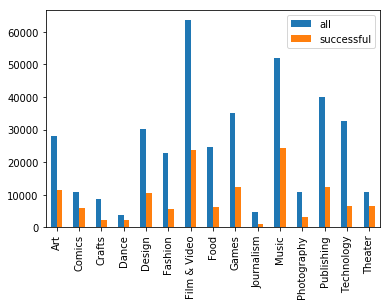

```python
import numpy as np 
import pandas as pd 
from IPython.core.display import display, HTML
```


```python
df = pd.DataFrame(pd.read_csv("../input/ks-projects-201801.csv"))
```


```python
all = df['main_category'].value_counts()
successful = df['main_category'][df['state'] == 'successful'].value_counts()
df2 = pd.DataFrame({'all': all, 'successful': successful})
df2.plot.bar()
```


    <matplotlib.axes._subplots.AxesSubplot at 0x7f356440fef0>





```python
success_rate = successful / all.astype(float)
df3 = pd.DataFrame({'success_rate': success_rate})
output = df3.to_html(formatters={'success_rate': '{:,.2%}'.format})

display(HTML(output))
```


<table border="1" class="dataframe">
  <thead>
    <tr style="text-align: right;">
      <th></th>
      <th>success_rate</th>
    </tr>
  </thead>
  <tbody>
    <tr>
      <th>Art</th>
      <td>40.88%</td>
    </tr>
    <tr>
      <th>Comics</th>
      <td>54.00%</td>
    </tr>
    <tr>
      <th>Crafts</th>
      <td>24.01%</td>
    </tr>
    <tr>
      <th>Dance</th>
      <td>62.05%</td>
    </tr>
    <tr>
      <th>Design</th>
      <td>35.08%</td>
    </tr>
    <tr>
      <th>Fashion</th>
      <td>24.51%</td>
    </tr>
    <tr>
      <th>Film &amp; Video</th>
      <td>37.15%</td>
    </tr>
    <tr>
      <th>Food</th>
      <td>24.73%</td>
    </tr>
    <tr>
      <th>Games</th>
      <td>35.53%</td>
    </tr>
    <tr>
      <th>Journalism</th>
      <td>21.28%</td>
    </tr>
    <tr>
      <th>Music</th>
      <td>46.61%</td>
    </tr>
    <tr>
      <th>Photography</th>
      <td>30.66%</td>
    </tr>
    <tr>
      <th>Publishing</th>
      <td>30.85%</td>
    </tr>
    <tr>
      <th>Technology</th>
      <td>19.75%</td>
    </tr>
    <tr>
      <th>Theater</th>
      <td>59.87%</td>
    </tr>
  </tbody>
</table>


```python
is_USA = df['currency'] == 'USD'
was_successful = df['state'] == 'successful'
was_failed = df['state'] == 'failed'

df4 = df[['main_category', 'usd pledged', 'usd_pledged_real', 'usd_goal_real']]

print(df4[is_USA & was_successful].groupby('main_category').median())
print('\n')
print(df4[is_USA & was_failed].groupby('main_category').median())
```

                   usd pledged  usd_pledged_real  usd_goal_real
    main_category                                              
    Art               2312.500          2797.250         2000.0
    Comics            3023.065          4184.000         3000.0
    Crafts            1274.000          1963.500         1000.0
    Dance             3066.500          3545.000         3000.0
    Design           10186.000         15435.000         8000.0
    Fashion           4654.500          6586.500         5000.0
    Film & Video      5032.000          5500.010         5000.0
    Food              6902.000          9538.000         7500.0
    Games             7869.005         11196.665         5000.0
    Journalism        3102.000          3975.000         3000.0
    Music             3385.500          4075.000         3500.0
    Photography       3132.000          3784.000         3000.0
    Publishing        3079.000          4096.000         3000.0
    Technology       14777.380         24652.500        10800.0
    Theater           2960.000          3185.000         3000.0
    
    
                   usd pledged  usd_pledged_real  usd_goal_real
    main_category                                              
    Art                   55.0              80.0         4000.0
    Comics               178.0             250.0         5000.0
    Crafts                25.0              38.0         3000.0
    Dance                100.0             124.0         5000.0
    Design               339.5             477.0        13000.0
    Fashion               50.0              63.0         5500.0
    Film & Video         101.0             125.0        10000.0
    Food                  75.0             101.0        12000.0
    Games                196.0             275.0        10000.0
    Journalism            14.0              25.0         5000.0
    Music                 56.0              75.0         5000.0
    Photography           51.0              65.0         5000.0
    Publishing            50.0              65.0         5000.0
    Technology            72.0             110.0        20000.0
    Theater              141.0             164.0         5000.0


```python
df.head()
```


<div>
<style>
    .dataframe thead tr:only-child th {
        text-align: right;
    }

    .dataframe thead th {
        text-align: left;
    }

    .dataframe tbody tr th {
        vertical-align: top;
    }
</style>
<table border="1" class="dataframe">
  <thead>
    <tr style="text-align: right;">
      <th></th>
      <th>ID</th>
      <th>name</th>
      <th>category</th>
      <th>main_category</th>
      <th>currency</th>
      <th>deadline</th>
      <th>goal</th>
      <th>launched</th>
      <th>pledged</th>
      <th>state</th>
      <th>backers</th>
      <th>country</th>
      <th>usd pledged</th>
      <th>usd_pledged_real</th>
      <th>usd_goal_real</th>
    </tr>
  </thead>
  <tbody>
    <tr>
      <th>0</th>
      <td>1000002330</td>
      <td>The Songs of Adelaide &amp; Abullah</td>
      <td>Poetry</td>
      <td>Publishing</td>
      <td>GBP</td>
      <td>2015-10-09</td>
      <td>1000.0</td>
      <td>2015-08-11 12:12:28</td>
      <td>0.0</td>
      <td>failed</td>
      <td>0</td>
      <td>GB</td>
      <td>0.0</td>
      <td>0.0</td>
      <td>1533.95</td>
    </tr>
    <tr>
      <th>1</th>
      <td>1000003930</td>
      <td>Greeting From Earth: ZGAC Arts Capsule For ET</td>
      <td>Narrative Film</td>
      <td>Film &amp; Video</td>
      <td>USD</td>
      <td>2017-11-01</td>
      <td>30000.0</td>
      <td>2017-09-02 04:43:57</td>
      <td>2421.0</td>
      <td>failed</td>
      <td>15</td>
      <td>US</td>
      <td>100.0</td>
      <td>2421.0</td>
      <td>30000.00</td>
    </tr>
    <tr>
      <th>2</th>
      <td>1000004038</td>
      <td>Where is Hank?</td>
      <td>Narrative Film</td>
      <td>Film &amp; Video</td>
      <td>USD</td>
      <td>2013-02-26</td>
      <td>45000.0</td>
      <td>2013-01-12 00:20:50</td>
      <td>220.0</td>
      <td>failed</td>
      <td>3</td>
      <td>US</td>
      <td>220.0</td>
      <td>220.0</td>
      <td>45000.00</td>
    </tr>
    <tr>
      <th>3</th>
      <td>1000007540</td>
      <td>ToshiCapital Rekordz Needs Help to Complete Album</td>
      <td>Music</td>
      <td>Music</td>
      <td>USD</td>
      <td>2012-04-16</td>
      <td>5000.0</td>
      <td>2012-03-17 03:24:11</td>
      <td>1.0</td>
      <td>failed</td>
      <td>1</td>
      <td>US</td>
      <td>1.0</td>
      <td>1.0</td>
      <td>5000.00</td>
    </tr>
    <tr>
      <th>4</th>
      <td>1000011046</td>
      <td>Community Film Project: The Art of Neighborhoo...</td>
      <td>Film &amp; Video</td>
      <td>Film &amp; Video</td>
      <td>USD</td>
      <td>2015-08-29</td>
      <td>19500.0</td>
      <td>2015-07-04 08:35:03</td>
      <td>1283.0</td>
      <td>canceled</td>
      <td>14</td>
      <td>US</td>
      <td>1283.0</td>
      <td>1283.0</td>
      <td>19500.00</td>
    </tr>
  </tbody>
</table>
</div>


